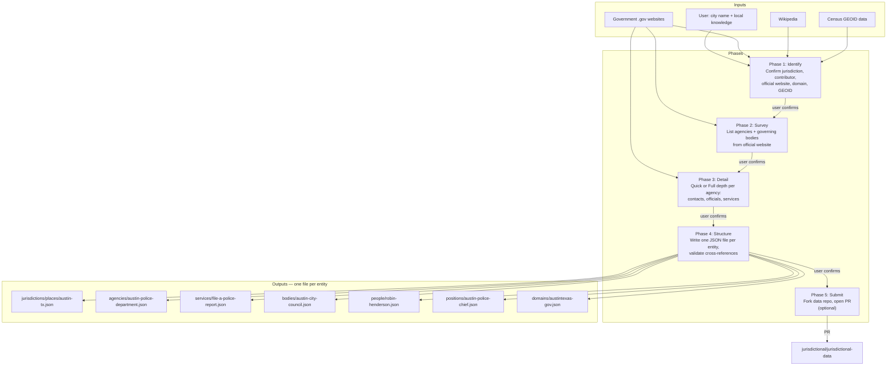

# jurisdictional-skill

A [Claude Code plugin](https://docs.anthropic.com/en/docs/claude-code) for crowdsourcing civic data about U.S. government structure.

The `gather` skill guides you through researching and structuring civic data — jurisdictions, agencies, services, officials — from public sources into a standard open data format.
The schema is based on the [jurisdictional.org](https://jurisdictional.org) data model.

## How it works



Each phase pauses for user review before continuing.
The user's local knowledge fills gaps and corrects what web research gets wrong.

## Install

Clone the repo into your Claude Code plugins directory:

```bash
git clone https://github.com/jurisdictional/gather-skill.git ~/.claude/plugins/gather-skill
```

Then run `/reload-plugins` in Claude Code.

## Usage

```
/gather Austin, TX
```

The skill will:

1. **Identify** the jurisdiction — confirm name, website, governance type, GEOID, `.gov` domain
2. **Survey** agencies and governing bodies from the official government website
3. **Detail** each agency — quick (name/type/url/description) or full (contacts, officials, services, budget)
4. **Structure** data into individual JSON files with `_meta` provenance and cross-reference validation
5. **Submit** to [jurisdictional-data](https://github.com/jurisdictional/jurisdictional-data) via PR (optional)

## Data format

One JSON file per entity, cross-referenced by filename slug:

```
jurisdictions/places/austin-tx.json
agencies/austin-police-department.json
services/file-a-police-report.json
bodies/austin-city-council.json
people/robin-henderson.json
positions/austin-police-chief.json
domains/austintexas-gov.json
```

Every file includes a `_meta` block with source URL, retrieval date, and contributor.

See [schema.md](skills/gather/schema.md) for the full specification and [examples/austin-tx/](skills/gather/examples/austin-tx/) for a complete sample.

## Contributing

The best way to contribute is to run the skill for your city and submit the resulting data.

Contributions to the skill itself are also welcome — see [SKILL.md](skills/gather/SKILL.md) for the prompt and phase definitions.
