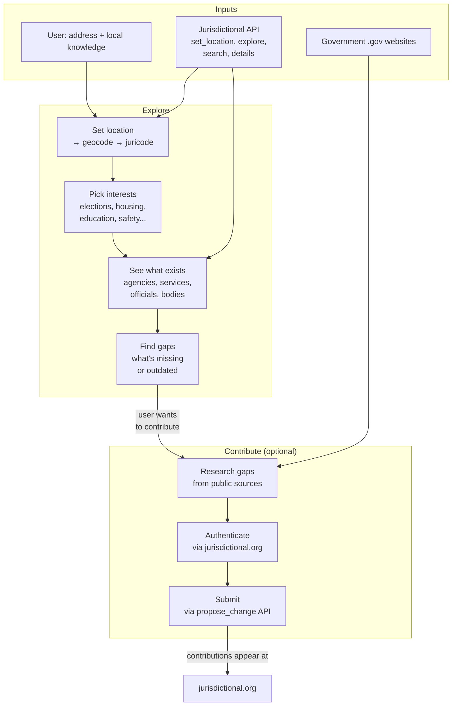

# jurisdictional-skill

A [Claude Code plugin](https://docs.anthropic.com/en/docs/claude-code) that connects you to the governments that serve your address.

Tell it where you live.
It shows you every layer of government — federal to local — the agencies, the people in office, the services you can access, and what's missing.
Then, if you want, it helps you fill the gaps.

## Usage

```
/gather 300 Hemlock Ave, Vacaville, CA
```

The skill starts by showing you what's there, not asking what to contribute.
Exploring is a complete experience — you don't have to add anything.

If you do want to help, the skill researches public sources, structures what it finds, and submits contributions directly to [jurisdictional.org](https://jurisdictional.org) via the API.

## How it works



The skill uses the [Jurisdictional MCP API](https://jurisdictional.org/api/mcp/tools) — 15 tools for searching jurisdictions, agencies, services, bodies, people, and positions by location, topic, or name.

## Install

```bash
git clone https://github.com/jurisdictional/jurisdictional-skill.git /tmp/jurisdictional-skill
cp -r /tmp/jurisdictional-skill/skills/gather ~/.claude/skills/gather
rm -rf /tmp/jurisdictional-skill
```

Then add the MCP server in Claude Code:

```
/mcp add-json jurisdictional '{"type":"url","url":"https://jurisdictional.org/api/mcp/message"}'
```

Start a new session and run `/gather` to start.

## Authentication

**Exploration works without sign-in.** The MCP tools are public.

To submit contributions, the skill will prompt you to sign in:

1. Opens `https://jurisdictional.org/auth/cli` in your browser
2. You authenticate via GitHub
3. Paste the token, or set `JURISDICTIONAL_TOKEN` in your shell

## What you can contribute

| Task | Description |
|------|-------------|
| Discover agencies | Find departments not yet in the database |
| Add contacts | Phone, email, address for existing agencies |
| Discover bodies | City councils, boards, commissions |
| Add officials | Who holds office and their positions |
| Add services | What residents can do or request |
| Meeting schedules | When governing bodies meet |
| Verify data | Check if existing records are still accurate |
| Add budget info | Financial and budget data |

## Civic topics

The skill can focus on what you care about:

Elections & voting, Budget & finance, Planning & zoning, Education, Water & utilities, Housing, Public safety, Transportation, Environment, Public health, Economic development, Civil rights

Or just tell it what you're following — "I've been tracking city council votes on water rates" works too.

## Data format

Contributions go directly to jurisdictional.org via the `propose_change` API.
If you also want local files, the skill can write one JSON file per entity:

```json
{
  "_meta": {
    "source": "https://www.cityofvacaville.com/departments/police",
    "retrieved_at": "2026-04-02",
    "contributor": "your-github-username"
  },
  "name": "Vacaville Police Department",
  "agency_type": "department",
  "jurisdiction": "vacaville-ca",
  "url": "https://www.cityofvacaville.com/departments/police",
  "phone": "707-449-5200"
}
```

See [schema.md](skills/gather/schema.md) for field definitions and [examples/austin-tx/](skills/gather/examples/austin-tx/) for a complete sample.

## Contributing

The best way to contribute is to run `/gather` for your city.

Contributions to the skill itself are welcome — see [SKILL.md](skills/gather/SKILL.md) for the prompt and flow definition.
